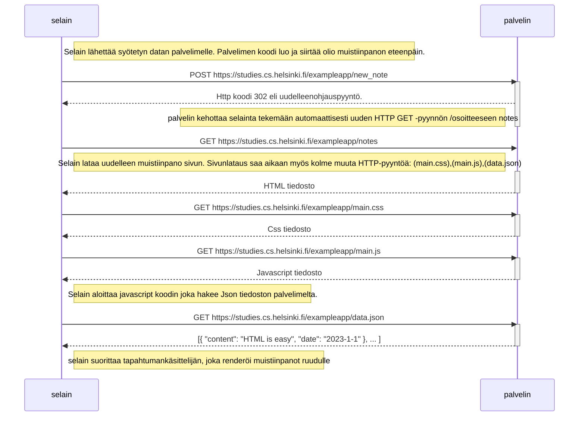

# 0.4: Uusi muistiinpano

```mermaid
sequenceDiagram
    participant selain
    participant palvelin

    Note right of selain: Selain lähettää syötetyn datan palvelimelle. Palvelimen koodi luo ja siirtää olio muistiinpanon eteenpäin.

    selain->>palvelin: POST https://studies.cs.helsinki.fi/exampleapp/new_note
    activate palvelin
    palvelin-->>selain: Http koodi 302 eli uudelleenohjauspyyntö.
    Note left of palvelin: palvelin kehottaa selainta tekemään automaattisesti uuden HTTP GET -pyynnön /osoitteeseen notes
    deactivate palvelin
    
    selain->>palvelin: GET https://studies.cs.helsinki.fi/exampleapp/notes
    Note right of selain: Selain lataa uudelleen muistiinpano sivun. Sivunlataus saa aikaan myös kolme muuta HTTP-pyyntöä: (main.css),(main.js),(data.json)
    activate palvelin
    palvelin-->>selain: HTML tiedosto
    deactivate palvelin
    
    selain->>palvelin: GET https://studies.cs.helsinki.fi/exampleapp/main.css
    activate palvelin
    palvelin-->>selain: Css tiedosto
    deactivate palvelin
    
    selain->>palvelin: GET https://studies.cs.helsinki.fi/exampleapp/main.js
    activate palvelin
    palvelin-->>selain: Javascript tiedosto
    deactivate palvelin
    
    Note right of selain: Selain aloittaa javascript koodin joka hakee Json tiedoston palvelimelta.
    selain->>palvelin: GET https://studies.cs.helsinki.fi/exampleapp/data.json
    activate palvelin
    palvelin-->>selain: [{ "content": "HTML is easy", "date": "2023-1-1" }, ... ]
    deactivate palvelin    

    Note right of selain: selain suorittaa tapahtumankäsittelijän, joka renderöi muistiinpanot ruudulle
```
